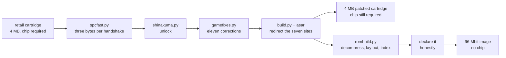
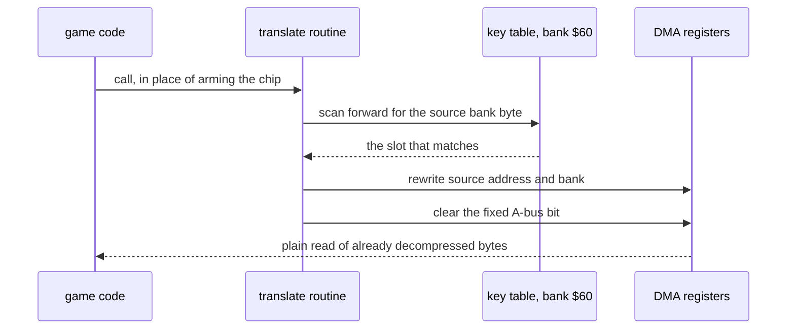
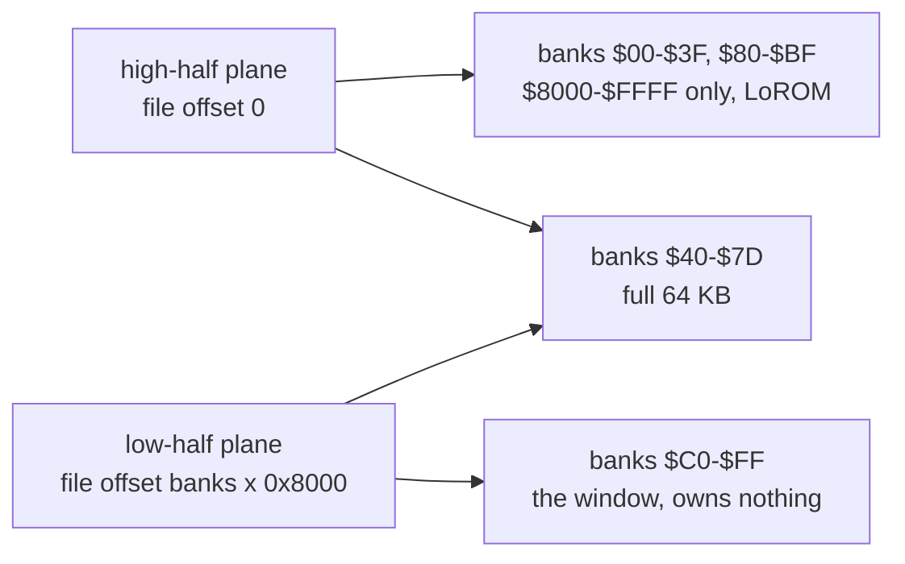

<div align="center">

# Street Fighter Alpha 2 without the S-DD1

**A plain ROM of Street Fighter Alpha 2 and Street Fighter Zero 2 with the decompression chip designed
out, so it runs from any flash cartridge that can hold it.**

[](https://github.com/gufranco/snes-street-fighter-alpha-2-nochip/actions/workflows/ci.yml)
[](https://github.com/gufranco/snes-street-fighter-alpha-2-nochip/releases)
[](LICENSE)

</div>

<p align="center">
  <a href="#quick-start"><strong>Quick start</strong></a> &nbsp;|&nbsp;
  <a href="#how-it-works">How it works</a> &nbsp;|&nbsp;
  <a href="#what-is-verified">Verification</a> &nbsp;|&nbsp;
  <a href="#repository-guide">Repository</a> &nbsp;|&nbsp;
  <a href="https://github.com/gufranco/snes-street-fighter-alpha-2-nochip/issues">Issues</a>
</p>

**No coprocessor** · **no mapper hardware** · **12,582,912 bytes** · both regions · pre-fight pause cut
to **0.72 s** · **623** tests · **zero** bytes of game data shipped

```bash
python3 tools/identify.py    # check your own cartridge dumps
python3 pack.py              # both regions, into dist/
```

You supply the retail ROM. Nothing here contains game data, and nothing ever will.

---

## What this is

Street Fighter Alpha 2 keeps most of its graphics compressed. A chip inside the retail cartridge, the
S-DD1, decompresses them mid-DMA as the game asks for them. No chip, no graphics.

This project decompresses every stream ahead of time, lays the result out in a larger image, and patches
the seven places where the game arms the chip so they read the finished bytes instead. The result is an
ordinary SNES ROM. There is no coprocessor to emulate, no mapper chip, and nothing special the cartridge
has to do beyond holding 96 Mbit and serving it.

The pause before every fight is a separate problem, and it was never the chip. It is the sound driver
handing samples to the audio chip one byte per handshake. Rewriting the receiving loop to carry three
bytes per handshake removes most of it.

<table>
<tr>
<td width="50%" valign="top">

### Runs on plain hardware

No coprocessor and no special mapping hardware. Any flash cartridge that can load a 96 Mbit ROM will run
it. Verified on a Game Doctor SF7 and an FXPAK Pro.

</td>
<td width="50%" valign="top">

### The pause, mostly gone

The longest pre-fight stall drops from 2.90 s to **0.78 s** on the USA build and from 2.60 s to
**0.72 s** on the Japanese one.

</td>
</tr>
<tr>
<td width="50%" valign="top">

### Both regions

Alpha 2 and Zero 2, each as a 96 Mbit chip-free image or as a 4 MB patched cartridge that keeps the
chip but loses the pause.

</td>
<td width="50%" valign="top">

### Shin Akuma, unlocked

Two bytes. He has been in the retail cartridge since 1996, behind a cheat that went undocumented until
2021.

</td>
</tr>
<tr>
<td width="50%" valign="top">

### Loads in snes9x

The map these images use is merged into snes9x master, so a current build opens them with no patch.

</td>
<td width="50%" valign="top">

### Reproducible from your own dump

Pinned containers, no network during a build, and a gate that refuses to write an image whose stream
table does not check out.

</td>
</tr>
</table>

---

## How it works

Four stages. The first two alone give a 4 MB cartridge that still needs the chip but has lost the pause.
All four give the chip-free image.



### The chip, and what replaces it

The S-DD1 does two things. It maps memory, which Alpha 2 never uses, leaving banks `$C0` to `$FF`
exposing the 4 MB linearly. And it decompresses: when the CPU writes a non-zero byte to `$4801` and
starts a DMA whose channel has a fixed A-bus address, the chip decodes a stream into the destination
instead of copying raw bytes. `$4801` clears itself, so the game re-arms it before every stream.

Seven sites in each region arm it. Each is replaced by a call to a shared routine that looks up where
the decompressed copy was placed, rewrites the DMA source, and clears the fixed A-bus bit so the
transfer becomes an ordinary incrementing read.



The lookup is four 64 KB tables in banks `$60` to `$63`, indexed by the low 16 bits of the source
address: the source bank as the key, then the destination low byte, high byte and bank. Two streams can
share the same low 16 bits, so a colliding key goes in the first free slot at or after its address and
the routine scans forward until the bank byte matches. Median scan distance is 0 in both regions and the
worst is 31.

### Why the image is 96 Mbit, and how it is addressed

Decompressed, the graphics come to about 5 MB, which does not fit a 4 MB cartridge. The image grows to
12 MB, and 12 MB does not fit the address space either: 192 banks of 64 KB is more than the 24-bit space
provides once mirrors and work RAM are accounted for.

The layout that solves it splits every bank in two and stores the halves in separate planes of the file.
Banks `$C0` and above own no storage at all. They are a window onto the second plane.



| banks | exposed | served from |
|---|---|---|
| `$00`-`$3F`, `$80`-`$BF` | `$8000`-`$FFFF` only, LoROM | the high-half plane |
| `$40`-`$7D` | full 64 KB, HiROM style | both planes |
| `$C0`-`$FF` | full 64 KB | the low-half plane, and never its own |

Bank `$C0+k` exposes the low half of bank `k` at `$8000`-`$FFFF` and the low half of bank `$80+k` at
`$0000`-`$7FFF`. That is how 192 banks of storage cover a 256-bank address space with no bank switching
and no mapping registers anywhere.

This document calls that a **windowed LoROM** map. Every other large-ROM SNES layout extends the address
space by adding linear banks; this one aliases a region onto a second storage plane, and that window is
the single property that separates it from ExLoROM, ExHiROM and Jumbo LoROM. The rule comes from
neviksti's Star Ocean chip-free conversion, recovered here by inspection.

The cartridge-map package implements both directions:

```python
def snes_to_file(bank, addr, banks):
    if addr < HALF:
        return (bank + banks) * HALF + addr
    return bank * HALF + (addr - HALF)
```

### The image contents

| region | contents |
|--------|----------|
| banks `$00`-`$3F` | the original ROM's LoROM view |
| banks `$40`-`$7D` | decompressed graphics |
| banks `$60`-`$63` | the four lookup tables |
| banks `$7E`-`$7F` | reserved, this is work RAM |
| banks `$80`-`$BF` | FastROM mirror of `$00`-`$3F` |
| banks `$C0`-`$FF` | the original 4 MB ROM, linear, as the window |

Decompressed graphics need more room than the free banks hold, so once a stream is decompressed the
compressed bytes it came from are reclaimed in the window banks, using each stream's real consumed
extent rather than the gap between markers.

### The pause

One pre-fight burst on the retail cartridge is 47,915 bytes at roughly 260 bytes per frame, one byte per
scanline. The bottleneck is the receiving loop in the audio chip's RAM, not the CPU: the game uploads
its own sound driver, which reimplements the boot protocol at about 55 cycles per byte.

Because that driver lives in RAM it can be replaced. The shipped receiver carries three bytes per
handshake, one in each data port, at 49 cycles for three bytes:

| | cycles per byte | longest stall, Japan | longest stall, USA |
|---|---|---|---|
| retail | 55 | 2.60 s | 2.90 s |
| **this build** | **16.3** | **0.72 s** | **0.78 s** |

The three destination pointers sit a third of a block apart, so the store index steps by one and the page
carry happens once per 256 handshakes instead of being tested on every store.

The game has seven uploaders and one of them also drives the audio chip's mask-ROM boot loader, which
can only ever take one byte per handshake. Rather than convert all of them, the driver dispatches on the
kind byte already present in each block header: 3 means triples, and the boot path is untouched. That
covers 93% of the driver traffic.

A second saving skips a base sample list whose request repeats, which the engine already has a path for.
It is worth 840,766 bytes on the USA cartridge and 303,340 on the Japanese one across a full roster tour.

### The pre-fight table

Before every fight the game spends 27 frames computing a 24,704 byte table that never changes. The
chip-free image ships the finished table and moves it with one DMA. The 4 MB cartridge keeps the builder,
because the largest run of filler anywhere in either retail ROM is 3,210 bytes and the table does not fit
at any address.

---

## What you get

`pack.py` writes the chip-free images. The other forms are built by the development tooling.

| form | size | needs the chip | what it is for |
|---|---|---|---|
| 96 Mbit chip-free | 12,582,912 bytes | no | any flash cartridge that holds it |
| 4 MB patched cartridge | 4,194,304 bytes | yes | hardware that already emulates the S-DD1 |

Both carry the faster sample upload, the Shin Akuma unlock and the corrections below. Only the chip-free
image carries the pre-fight table.

### The corrections

Eleven entries, 214 bytes on the USA build and 56 on the Japanese one, in [`gamefixes.py`](gamefixes.py).
Every entry is found by a byte signature rather than a hardcoded offset, so one table covers both
regional ROMs, a ROM that does not match refuses the patch instead of writing into the wrong place, and
applying it twice is a no-op.

| fix | regions | what it does |
|---|---|---|
| Sodom name, four screens | USA | restores the name the USA release changed to Katana, under the life bar, on the select screen, on the versus screen and on the results screen |
| Akuma win pose order | both | arcade order, with the silent pose index moved to match |
| Object table overflow | both | stops the live-object count exceeding the number of objects that exist when a ninth shadow frame is requested |
| Thrown father sprite | both | three sprite records in the frame where Sagat holds Dan's father |
| Empty call removal | both | 45 long calls to a bare `rtl` whose next byte is `rts`, rewritten to return directly |

---

## Quick start

### Prerequisites

| Tool | Version | Why |
|:-----|:--------|:----|
| [Python 3](https://www.python.org/) | 3.12 | every analysis and build module |
| [Docker](https://www.docker.com/) | any current, running | pins asar, the emulator and the reference decompressor |
| Your own cartridge dumps | 4,194,304 bytes each | placed in `roms/` under the names below |

Nothing is installed from a package index. The build containers pin their toolchains, run with no network
access, and run as a non-root user.

### The dumps

Named as No-Intro names them. Every digest is of the whole file with no copier header. SHA-256 is the one
that decides; the others are there to cross-check against databases that still key on them.

| file | read as | size |
|---|---|---|
| Street Fighter Alpha 2, USA | `roms/sfa2-usa-final.sfc` | 4,194,304 |
| Street Fighter Zero 2, Japan | `roms/sfz2-jp-final.sfc` | 4,194,304 |
| DarkAkuma's SNES Classic dump | `roms/sfa2-usa-vc-sound-restored.sfc` | 4,194,304 |

| file | SHA-256 | CRC32 |
|---|---|---|
| USA | `910a29f834199c63c22beddc749baba746da9922196a553255deade59f4fc127` | `9C59DDFF` |
| Japan | `f15731675e22dbf3882b777b2d8cd541a637dfdf5d8880c83903cf1e0b64590e` | `7455A7CF` |
| tagged | `f8aa2ae1f4bc993092fc282a883ecaf669269c17a175a5f43fa95e9da6459dc0` | `72A9E2C1` |

The third file is not a retail cartridge. It carries stream tags and is needed only to regenerate
[`usastreams.py`](usastreams.py), never to build an image. Both stream tables are frozen into the
repository, so a build needs your retail dumps and nothing else.

### Build

```bash
git clone --recurse-submodules https://github.com/gufranco/snes-street-fighter-alpha-2-nochip.git
cd snes-street-fighter-alpha-2-nochip
# put your dumps in roms/, then:
python3 tools/identify.py    # confirms each dump against its published digest
python3 pack.py              # both regions into dist/, named with the version
python3 pack.py jp           # or one region
```

The models this project measures itself against are pinned as submodules, so the flag is not
optional. If you already cloned without it, `git submodule update --init --recursive` fixes the
clone you have. GitHub's Download ZIP button cannot work here at all: a source archive never
carries submodule content, and nothing can add it afterwards. Clone it.

`pack.py` runs the build gate first and refuses to write anything if the stream table fails it. It
produces `sfa2-usa-nochip-v<version>.sfc` and `sfz2-jp-nochip-v<version>.sfc` alongside a `SHA256SUMS`
manifest.

### Verify

```bash
python3 tools/verify_streams.py    # every stream against snes9x's own decompressor
python3 tools/verify_image.py      # every stream inside the finished image
```

```
usa  2817 streams  0 unresolved lookups  0 wrong bytes
jp   2855 streams  0 unresolved lookups  0 wrong bytes
```

### Building the stages by hand

```bash
python3 spcfast.py    roms/sfa2-usa-final.sfc  build/step1.sfc   # faster sample upload
python3 shinakuma.py  build/step1.sfc          build/step2.sfc   # unlock
python3 gamefixes.py  build/step2.sfc          build/step3.sfc   # the corrections
python3 build.py      asm/sdd1-bypass.asm build/step3.sfc bypass.sfc
python3 rombuild.py   asm/bypass.sfc roms/sfa2-usa-vc-sound-restored.sfc build/nochip.sfc
python3 -c 'import hardware, pathlib; r = hardware.load("romimage"); pathlib.Path("build/final.sfc").write_bytes(r.rewrite.declare_rom_only(r.dump.read("build/nochip.sfc")))'
```

Order matters. The sample and unlock patches apply to the retail ROM, the bypass has to come before the
re-layout because the re-layout reclaims the compressed data it reads, and the header comes last because
it checksums the finished image. For the Japanese build, substitute `asm/sdd1-bypass-jp.asm`.

---

## What is verified

Every change is built and run across both regions, all four patch sets and both cartridge forms, and
each image runs for 12,000 frames.

| checked | how |
|---------|-----|
| boots and renders | video frames delivered, and frame brightness sampled every 300 frames |
| sound runs | APU port write counts |
| sample uploads intact | every block compared byte for byte against its ROM source |
| menus respond | fights load, which only happens by passing through the menus |
| pause | longest pre-fight upload burst |
| graphics lookups | table scan length, where anything over 64 steps is a miss |
| Shin Akuma | `$7E:1B09` reads `$4A4B` only where patched |

Latest run: 20 images, every one `load=ok`, 12,000 of 12,000 frames delivered, **zero lookup misses**.
The sixteen shipping images are two regions by four patch sets by two cartridge forms; four extra USA
control builds each drop one patch so its effect can be measured against an otherwise identical image.

| region | patches | cartridge | 96 Mbit chip-free |
|--------|---------|-----------|-------------------|
| USA | none | 2.90 s | 3.13 s |
| USA | fast upload | **0.78 s** | **0.77 s** |
| USA | both | **0.78 s** | **0.77 s** |
| Japan | none | 2.60 s | 2.60 s |
| Japan | fast upload | **0.72 s** | **0.72 s** |
| Japan | both | **0.72 s** | **0.72 s** |

Every image carrying the sound patch is also driven through all eighteen fighters in turn, resetting
between them: 50,652 sample uploads verified, zero bad.

### Offline checks

| check | what it settles |
|---|---|
| [`tools/verify_streams.py`](tools/verify_streams.py) | all 2,817 USA and 2,855 Japanese streams through snes9x's own `sdd1emu.cpp` in a container, compared byte for byte with the Python decompressor |
| [`tools/verify_image.py`](tools/verify_image.py) | walks the finished image's lookup tables the way the console does and compares the bytes actually sitting at each destination |
| [`gate.py`](gate.py) | refuses an image whose table has repeated sources, an entry that does not decode to its recorded length, a key scan outside budget, or a recorded hardware request it does not cover |
| [`tools/freeze_spcfast.py`](tools/freeze_spcfast.py) | proves the frozen sound patch still reproduces the assembler's output byte for byte |

### On hardware

| hardware | image | result |
|----------|-------|--------|
| Game Doctor SF7, 128 Mbit DRAM | USA, 96 Mbit chip-free | runs |
| FXPAK Pro | USA, 96 Mbit chip-free | runs |
| FXPAK Pro | USA, 4 MB patched cartridge | runs |

Neither cartridge does anything special for these images. The FXPAK Pro emulates the S-DD1 in its FPGA,
which is why the 4 MB form runs there, and that emulation is idle for the chip-free image.

The Japanese build has only been run under emulation. It is byte-for-byte the same construction as the
USA one and passes the same checks, but nobody has yet put it on a console.

---

## Known limits

**The Japanese stream table cannot be proved complete.** A stream nobody asks for cannot be found. The
table is correct for all 1,661 requests recorded from working hardware, and the search converged, but
that is the strongest statement available and it is not proof. If a screen ever comes up wrong, the fix
is mechanical: drive the retail cartridge to that screen, read what it asks the chip for, and add it. The
USA table came out of a tagged dump and does not have this problem.

**Two corrections are not demonstrated on screen.** The object table overflow needs eight simultaneous
shadow frames plus a projectile collision, and the thrown father sprite sits in a scene no driver here
reaches. Both rest on the disassembly rather than on a before and after, and the same runs prove neither
changes anything that is reached.

---

## Emulator support

These images need a map no emulator had. That map is now merged into snes9x as
[pull request 1082](https://github.com/snes9xgit/snes9x/pull/1082), so a current build loads them out of
the box. The discussion is in [issue 1081](https://github.com/snes9xgit/snes9x/issues/1081) and the work
is on the [`sdd1-decompressed-map`](https://github.com/gufranco/snes9x/tree/sdd1-decompressed-map)
branch of a fork.

Two things had to be fixed. Circulating chip-free conversions keep the retail header, so they claim a
chip they no longer contain, and an emulator matching on that enables chip emulation and applies the
wrong layout. The image package rewrites the chipset and size fields at all six places the header
appears in these images, since the original ROM is mirrored into the window banks and the FastROM
mirror, and correcting only the two documented positions leaves a dishonest copy for the scoring to
find. With an honest header the remaining problem is that the layout itself is unknown, which is what
the merged change adds.

The same gap likely exists in ares, Mesen2, bsnes and Mednafen. Nothing has been sent to them, because
each would need building and running against both conversions first.

---

## Checking a patch that changes the audio path

Two patches here change how the cartridge feeds the audio processor: one replaces the sample-upload
loop with a faster one, the other skips an upload when the list asked for is the one already loaded.
Neither is allowed to change which bytes the audio processor ends up holding.

Listening cannot settle that, and neither can diffing the audio processor's memory at the end of a
run: the patch changes when things happen, so the two runs stop with the driver mid-note in
different places, and thousands of bytes differ without meaning anything.

```bash
python3 tools/compare_audio.py build/all/jp-base-cart.sfc build/all/jp-spc-cart.sfc
python3 tools/compare_audio.py --fights build/all/jp-spc-cart.sfc build/all/jp-repeat-cart.sfc
```

The comparison is per upload. Every block the cartridge hands over is checked against the bytes still
in the cartridge, so a faster loop that drops a byte fails on the block it dropped it in, whatever
the driver is doing afterwards. Alongside that it reports which sources were uploaded at all, since
a skip is supposed to upload fewer of them and never different ones, and how many writes each block
took, which is the one number a faster loop is supposed to change.

The roster tour alone never reaches the skip: every character loads a different list. `--fights`
enters a fight and returns, which is the only way to ask for a list that is already loaded.

## The hardware this is checked against

```bash
git clone --recurse-submodules https://github.com/gufranco/snes-street-fighter-alpha-2-nochip.git
```

The models this project measures itself against are not written here. Each is its own repository,
pinned as a submodule at the root of this one under the name of the repository it is, and each is
held to something outside itself
rather than to its author's confidence.

| model | what proves it |
|---|---|
| [65816](https://github.com/gufranco/mos65xx-python) | a per-opcode suite, 5,120,000 cases |
| [SPC700](https://github.com/gufranco/sony-spc700-python) | a per-opcode suite, 256,000 cases |
| [S-DD1](https://github.com/gufranco/snes-sdd1-python) | the chip's own reference implementation |
| [S-DSP](https://github.com/gufranco/sony-s-dsp-python) | the mixer's own reference implementation |
| [cartridge map](https://github.com/gufranco/snes-mapper-python) | every header combination in a real cartridge library |
| [ROM image](https://github.com/gufranco/snes-rom-image-python) | the whole of that same library, rewritten and checked |

They also start dirty. Memory and registers hold arbitrary but reproducible values rather than
zeroes, because real hardware does, and anything here that wants a cleared machine has to ask for
one. That turns a read of something never written from an accident into a question.

## When something is wrong

```bash
python3 doctor.py
```

It looks at this machine and prints what is actually there: the Python, every model this project is
pinned to and its version, whether the decompressor runs, which dumps are present and the SHA-256 of
each, and whether the toolchain a build shells out to is reachable. It then asks every model for its
own report and files what comes back under that model's name, so the whole chain is in one place
rather than one layer of it.

Nothing is inferred and nothing is hidden. A check that fails says what it saw, and a check that
itself throws is reported as what it threw rather than taking the report down with it. Paste all of
it into an issue.

## Repository guide

Analysis modules in Python, each with its tests beside it, assembly that goes into the ROM, and a pinned
container per toolchain.

| file | role |
|------|------|
| [`sdd1ref.py`](sdd1ref.py) | differential test against the C reference |
| [`sdd1map.py`](sdd1map.py) | stream table extraction from a tagged ROM |
| [`sdd1find.py`](sdd1find.py) | content search for streams |
| [`sdd1sites.py`](sdd1sites.py) | finds every write to the chip's registers |
| [`sdd1tables.py`](sdd1tables.py) | builds and verifies the lookup tables |
| [`usastreams.py`](usastreams.py) | the USA stream table |
| [`jpstreams.py`](jpstreams.py) | the Japanese stream table |
| [`requests_jp.py`](requests_jp.py) | decompression requests recorded from working hardware |
| [`rombuild.py`](rombuild.py) | assembles the 96 Mbit image |
| [`mapcheck.py`](mapcheck.py) | validates a stream table offline |
| [`gate.py`](gate.py) | the checks an image must pass before it is written |
| [`pack.py`](pack.py) | builds the release images, named with the version |
| [`spcfast.py`](spcfast.py) | applies the sample upload patch |
| [`repeatload.py`](repeatload.py) | applies the skip for a sample list already loaded |
| [`tools/compare_audio.py`](tools/compare_audio.py) | checks a build's uploads against a stock one, block by block |
| [`tools/sample_audit.py`](tools/sample_audit.py) | reads sound RAM as the audio chip reads it, and reports samples a skipped upload would leave broken |
| [`tools/driver_run.py`](tools/driver_run.py) | runs the audio driver on the processor model and measures what its transfer costs, before the patch and after |
| [`shinakuma.py`](shinakuma.py) | applies the Shin Akuma unlock |
| [`gamefixes.py`](gamefixes.py) | applies the corrections |
| [`prefight.py`](prefight.py) | computes the pre-fight table and redirects both of the builder's callers |
| [`patchrun.py`](patchrun.py) | executes the assembled patch against a memory model |
| [`hardware.py`](hardware.py) | puts the pinned hardware models on the import path |
| [`doctor.py`](doctor.py) | what is actually on this machine, the whole chain, printed for a bug report |
| [`artifacts.manifest.json`](artifacts.manifest.json) | every dump this project reads, and what makes each one itself |
| [`mos65xx-python/`](mos65xx-python/) | the 65816, held to a per-opcode suite |
| [`sony-spc700-python/`](sony-spc700-python/) | the audio processor, held to its own suite |
| [`sony-s-dsp-python/`](sony-s-dsp-python/) | the audio mixer, held to states taken from real music |
| [`snes-sdd1-python/`](snes-sdd1-python/) | the decompressor, held to an independent encoder |
| [`snes-mapper-python/`](snes-mapper-python/) | the cartridge map, held to a library of real cartridges |
| [`snes-rom-image-python/`](snes-rom-image-python/) | image handling, held to that same library |
| [`analyse.py`](analyse.py) | compression ratios and chunk indexing |
| [`build.py`](build.py) | Docker wrapper around asar |
| [`version.py`](version.py) | the release number, rewritten by [`scripts/set-version.sh`](scripts/set-version.sh) |

Development tooling is in [`tools/`](tools/). None of it is needed to build an image.

| file | what it does |
|------|--------------|
| [`tools/identify.py`](tools/identify.py) | checks the cartridge dumps against their published digests |
| [`tools/rebuild_all.py`](tools/rebuild_all.py) | builds every region, patch set and cartridge form |
| [`tools/validate_all.py`](tools/validate_all.py) | runs each one for 12,000 frames and prints the verification table |
| [`tools/verify_streams.py`](tools/verify_streams.py) | every stream through snes9x's own decompressor |
| [`tools/verify_image.py`](tools/verify_image.py) | walks the finished image's lookup tables |
| [`tools/freeze_spcfast.py`](tools/freeze_spcfast.py) | keeps the frozen sound patch in step with its assembly |
| [`tools/tour_oracle.py`](tools/tour_oracle.py) | drives the retail cartridge and records what it asks the chip for |
| [`tools/tour_audio.py`](tools/tour_audio.py) | plays every fighter in turn and reports corrupt uploads |
| [`tools/sample_reuse.py`](tools/sample_reuse.py) | replays every sample upload against a shadow of sound RAM |
| [`tools/stage_diff.py`](tools/stage_diff.py) | drives two builds through every matchup and reports which frames differ |
| [`tools/harvest_jp.py`](tools/harvest_jp.py) | proposes stream candidates for the gate to judge |
| [`tools/converge_jp.py`](tools/converge_jp.py) | the loop that runs those until a round finds nothing new |

Assembly that goes into the ROM is in [`asm/`](asm/), with its own container pinning asar:
the bypass patches for both regions, the shared translate routine, the sample upload patch, the repeated
load skip, the pre-fight table loader, and the Shin Akuma unlock for both regions.

[`emu/`](emu/) holds the harness the project validates against, a headless libretro frontend with the
windowed LoROM map and a large set of instruments, plus [`emu/play.cpp`](emu/play.cpp), an SDL2 frontend
for looking at the game. [`ref/`](ref/) is the pinned container holding snes9x's own `sdd1emu.cpp`,
verified by sha256, which is the reference the Python decompressor is tested against.

---

## Working on this

### Running the checks

| What | Command |
|:-----|:--------|
| Every test | `for t in *.test.py tools/*.test.py; do python3 "$t" \|\| break; done` |
| Lint | `ruff check .` |
| Format | `ruff format --check .` |
| Workflows | `actionlint` |
| Shell | `shellcheck --severity=style --shell=bash scripts/*.sh` |
| The image matrix | `python3 tools/rebuild_all.py && python3 tools/validate_all.py` |

623 tests across 37 modules, 354 beside the analysis modules and 269 beside the tools. Several need the
retail cartridges and skip cleanly without them, so a fresh clone runs the suite green.

### Conventions

| Convention | Where |
|:-----------|:------|
| Commit messages | [Conventional Commits](https://www.conventionalcommits.org/), which drives the version number |
| Python style | [`pyproject.toml`](pyproject.toml), ruff at line length 100, targeting 3.12 |
| Tests | one `<module>.test.py` beside each module, standard library `unittest` |
| Comments | required in the assembly and only there: entry and exit state, register widths, and where each recovered address came from |
| Builds | in Docker, pinned, no network, non-root. Never on the host |
| Releases | semantic versioning cut by the pipeline. Each image carries its version in the filename |

### Decisions worth knowing

- **No ROM data enters this repository.** Not dumps, not intermediates, not test fixtures. It is why the
  suite skips rather than fails without them.
- **The cartridge is the only oracle for what a stream is.** Decompressing a candidate proves nothing:
  the format has no header, no length and no terminator, so any offset decodes to something.
- **Only two operations on a stream table are safe**, adding an address the hardware asks for and raising
  a length to what it asks for. Shortening an entry is never valid.
- **The stream tables are frozen, and the tools that produced them are kept.** A frozen table is a claim,
  and keeping the generator is what allows the claim to be remade.
- **Every change is validated on both regions and both cartridge forms** before it is called done.

Bugs and wrong screens belong in [GitHub Issues](https://github.com/gufranco/snes-street-fighter-alpha-2-nochip/issues). A wrong
screen is the most useful report this project can receive, because it is the one failure mode the checks
here cannot find on their own. Say which image and region, and capture the frame if you can.

---

## Contributing

Measurements first. [CONTRIBUTING.md](CONTRIBUTING.md) has the gates a change is expected to pass,
[SECURITY.md](SECURITY.md) says what belongs in a private report, and the
[Code of Conduct](CODE_OF_CONDUCT.md) applies wherever this project is discussed.

Never attach a cartridge or anything decoded out of one, and never link to somewhere one can be
downloaded. A digest identifies a file without carrying it.

## Citing this

[CITATION.cff](CITATION.cff) is kept in step with the released version by the same script that
stamps the release, so the version it names is the version that shipped.

## Acknowledgements

This project is assembled almost entirely out of other people's work.

**Andreas Naive** reverse engineered the S-DD1 compression algorithm. Without that published work there
is no project at all.

**Modern Vintage Gamer** made [the video](https://www.youtube.com/watch?v=fB9GlZUYNUQ) that started this,
and made the point that the pause is the sound rather than the chip.

**gizaha** did the original work on the pause and published a
[changelog](https://www.zeldix.net/t1831-street-fighter-alpha-2) precise enough to act as a
specification.

**DarkAkuma** produced the SNES Classic patch whose `SDD1` marker tags gave the USA stream map.

**neviksti and the Star Ocean chip-free conversion**, which was the ground truth for the decompressor and
the source of the addressing rule.

**The snes9x team**, for the emulator, for `sdd1emu.cpp` as the reference the Python decompressor is
tested against, and for reviewing and merging the mapper.

**The bsnes project**, whose disassembler tables both disassemblers here were extracted from.

**The Zeldix community**, where most of the SNES romhacking knowledge this leans on is written down.

**Whoever found the Shin Akuma code** after 25 years, reported in January 2021.

---

## References

- Modern Vintage Gamer, [A closer look at Street Fighter Alpha 2 on the Super Nintendo](https://www.youtube.com/watch?v=fB9GlZUYNUQ)
- [Street Fighter Alpha 2 thread on Zeldix](https://www.zeldix.net/t1831-street-fighter-alpha-2), gizaha's patches and changelog
- Nintendo Life, [After 25 Years, A New Cheat Code Has Been Discovered For Street Fighter Alpha 2 On The SNES](https://www.nintendolife.com/news/2021/01/after_25_years_a_new_cheat_code_has_been_discovered_for_street_fighter_alpha_2_on_the_snes)
- [Retroware, The Curious Case of Street Fighter Alpha 2 on the SNES](https://articles.retroware.com/2021/03/08/the-curious-case-of-street-fighter-alpha-2-on-the-snes/)
- [snes9x](https://github.com/snes9xgit/snes9x), `sdd1emu.cpp` for the compression reference and `iplrom.cpp` for the S-SMP boot ROM listing
- [snes9x issue 1081](https://github.com/snes9xgit/snes9x/issues/1081) and [pull request 1082](https://github.com/snes9xgit/snes9x/pull/1082)

---

## Legal

No ROM data is distributed here. Everything in this repository operates on files you must already own,
and the patches are derived from analysis of retail cartridges you supply.

The tooling, the assembly and this document are released under the [MIT licence](LICENSE), so that the
emulator mapper can be taken by projects whose own licences range from GPL to snes9x's non-commercial
terms. That covers my own work and nothing else. It grants no rights in the game.
